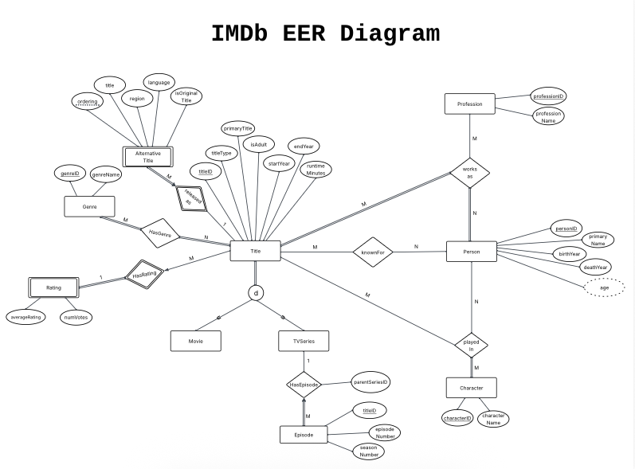

## IMDb Database System

Java command-line application for querying an (smaller-version) IMDb movie database.

## Compile and Run (some remarks)

- Make sure mssql-jdbc.jar file is in the lib/ directory. (Microsoft JDBC Driver)
- Make sure auth.cfg credentials are correct. (authentication configuratoin for Uranium)

## How to Run

```bash
make compile
make run

# OR just

make run
```

## Project Structure

```
src/
 Main.java           # Entry point
 database/           # DatabaseConfig, DatabaseManager, DatabaseLoader
 logic/              # TitleQueries, PersonQueries, CharacterQueries, GenreQueries
 ui/                 # Interface, MenuSystem, StatisticsDisplay
 utils/              # ResultFormatter, QueryUtils, InputValidator
```

## Features

- Search movies, TV shows, actors, characters
- Complex analytical queries
- Database statistics and management

---

## COMP 3380 Group 40 [FALL 2025]

- Jian Yang
- Mohammad Mohid Afzal
- Mohammad Mujahidul Islam

## Files explanation in details

### Presentation (`ui/`)

- Interface - Main UI coordinator
- MenuSystem - Menu displays
- StatisticsDisplay - Database stats

### Logic (`logic/`)

- TitleQueries - Movie/TV queries
- PersonQueries - Actor/director queries
- CharacterQueries - Character queries
- GenreQueries - Genre/statistics queries

### Data (`database/`)

- DatabaseConfig - Connection management
- DatabaseManager - DB operations
- DatabaseLoader - SQL loading

### Utilities (`utils/`)

- ResultFormatter - Pagination & formatting
- QueryUtils - Shared helpers
- InputValidator - Input validation

## ER Diagram


